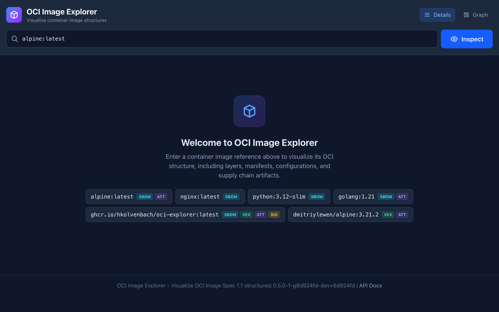
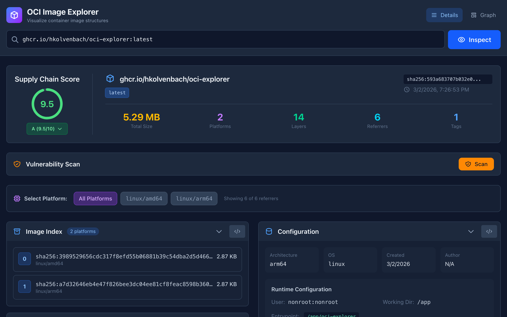
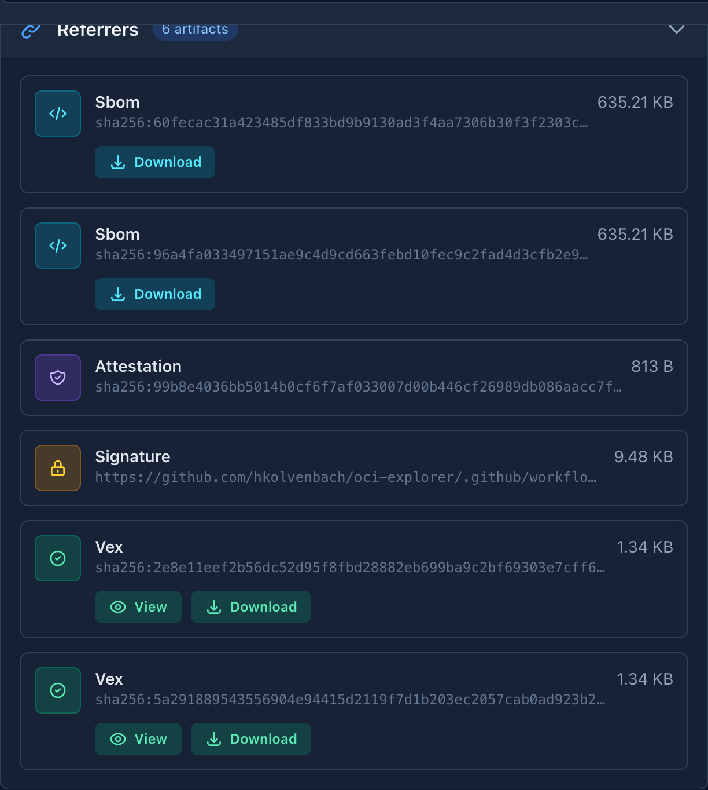
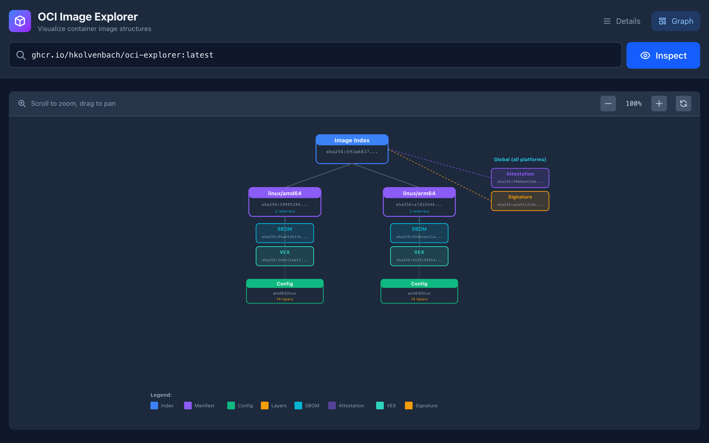

# OCI Image Explorer

A local Go application that visualizes OCI container image structures including layers, manifests, referrers, SBOMs, attestations, and other supply chain artifacts.

  

## Features

- **Multi-platform Image Index** - Visualize fat manifests with multiple architecture variants
- **Layer Inspection** - View layer digests, sizes, media types, and annotations
- **Configuration Details** - See runtime config including entrypoint, cmd, env vars, exposed ports
- **Build History** - Trace the Dockerfile commands that created each layer
- **Referrers (OCI 1.1)** - View attached artifacts:
  - Signatures (Notary, Cosign) with Sigstore certificate identity and OIDC issuer
  - SBOMs (CycloneDX, SPDX) with inline download
  - Attestations (SLSA Provenance, In-Toto)
  - VEX (OpenVEX) with status badges and vulnerability details
  - Vulnerability Scans
- **Cosign Tag Discovery** - Finds `.sig` and `.att` cosign tags alongside OCI Referrers API
- **Tag Listing** - Browse all tags for a repository
- **Security Score** - At-a-glance 0-10 score with animated ring, grading supply chain artifact presence (signatures, SBOMs, attestations, VEX) with expandable detail panel
- **Copyable Digests** - Click any SHA digest in the UI to copy it to the clipboard
- **Graph View** - Interactive graph with pan/zoom showing relationships between components
- **Mobile Responsive** - Adaptive layout that works on phones and tablets
- **Version Display** - Backend binary version shown in the footer via `/api/health`
- **Authentication** - Uses Docker credential helpers for private registries

## Quick Start

### Prerequisites

- Go 1.24 or later
- Make (optional, for build automation)

### Build & Run

```bash
# Clone or download this project
git clone https://github.com/hkolvenbach/oci-explorer.git
cd oci-explorer

# Download dependencies
go mod tidy

# Build and run
make run

# Or manually
go build -o build/oci-explorer .
./build/oci-explorer
```

The application starts a web server at http://localhost:8080

## Screenshots

### CLI Startup

```
┌─────────────────────────────────────────────────┐
│            🐳 OCI Image Explorer                │
├─────────────────────────────────────────────────┤
│  URL:      http://localhost:8080                │
│  Platform: darwin/arm64                         │
│  Version:  0.1.0                                │
│  Press Ctrl+C to stop                           │
└─────────────────────────────────────────────────┘
```

### Landing Page



### Details View

Inspecting `ghcr.io/hkolvenbach/oci-explorer:latest` — shows platforms, layers, configuration, and build history:



### Referrers View

Supply chain artifacts: cosign signatures with Sigstore identity, SBOMs, attestations, and VEX documents:



### Graph View

Interactive graph visualization of the full image structure:



### Command Line Flags

| Flag | Short | Default | Description |
|------|-------|---------|-------------|
| `--port` | | `8080` | HTTP server port |
| `--verbose` | `-v` | `false` | Enable verbose logging |

```bash
# Run on a different port
./build/oci-explorer --port 3000

# Run with verbose logging
./build/oci-explorer -v
```

### Environment Variables

| Variable | Default | Description |
|----------|---------|-------------|
| `PORT` | `8080` | HTTP server port |

## Building for Multiple Platforms

Build binaries for all supported platforms:

```bash
make build-all
```

This creates binaries in the `build/` directory for:
- Linux (amd64, arm64)
- macOS (amd64, arm64)

Create release archives:

```bash
make release
```

## API Endpoints

### GET /api/inspect

Inspect an OCI image and return its full structure.

**Query Parameters:**
- `image` (required) - Image reference (e.g., `nginx:latest`, `ghcr.io/org/repo:tag`)

**Response:**
```json
{
  "success": true,
  "data": {
    "repository": "library/nginx",
    "tag": "latest",
    "digest": "sha256:abc123...",
    "imageIndex": { ... },
    "manifest": { ... },
    "config": { ... },
    "tags": ["latest", "1.25", "1.25.3"],
    "referrers": [ ... ]
  }
}
```

### GET /api/tags

List all tags for a repository.

**Query Parameters:**
- `repository` (required) - Repository reference (e.g., `nginx`, `ghcr.io/org/repo`)

### GET /api/sbom

Download SBOM content from an attestation manifest.

**Query Parameters:**
- `repository` (required) - Full repository name
- `digest` (required) - Digest of the attestation manifest containing the SBOM

**Response:** Raw SBOM content (SPDX or CycloneDX JSON) with `Content-Disposition: attachment`

### GET /api/vex

Fetch and parse a VEX (Vulnerability Exploitability eXchange) document from an attestation.

**Query Parameters:**
- `repository` (required) - Full repository name
- `digest` (required) - Digest of the attestation manifest containing the VEX document

**Response:** Parsed OpenVEX document with statements, status, justifications, and product identifiers.

### GET /api/health

Health check endpoint.

## Usage Examples

### Inspect Public Images

```bash
# Docker Hub
curl "http://localhost:8080/api/inspect?image=nginx:latest"
curl "http://localhost:8080/api/inspect?image=alpine:3.19"

# GitHub Container Registry
curl "http://localhost:8080/api/inspect?image=ghcr.io/sigstore/cosign/cosign:latest"

# Google Container Registry
curl "http://localhost:8080/api/inspect?image=gcr.io/distroless/static:latest"
```

### Inspect Private Images

The application uses Docker's credential helpers. Log in first:

```bash
# Docker Hub
docker login

# GitHub Container Registry
docker login ghcr.io

# AWS ECR
aws ecr get-login-password | docker login --username AWS --password-stdin <account>.dkr.ecr.<region>.amazonaws.com
```

Then inspect:
```bash
curl "http://localhost:8080/api/inspect?image=ghcr.io/myorg/private-image:v1"
```

## Supply Chain Security

All release artifacts are signed and attested for end-to-end supply chain verification.

| Artifact | Protection |
|----------|-----------|
| Docker image | Cosign keyless signature (Sigstore OIDC) |
| Docker image | SLSA Build Provenance attestation |
| Docker image | Embedded SBOM (BuildKit) |
| Docker image | OpenVEX attestation (govulncheck-based) |
| Release binaries | GitHub Artifact Attestation (SLSA provenance) |
| Runtime base | `gcr.io/distroless/static-debian12` (zero CVEs, no shell) |

### Verify image signature

```bash
cosign verify \
  --certificate-identity-regexp="https://github.com/hkolvenbach/oci-explorer" \
  --certificate-oidc-issuer="https://token.actions.githubusercontent.com" \
  ghcr.io/hkolvenbach/oci-explorer:latest
```

### Verify SLSA provenance

```bash
cosign verify-attestation \
  --type slsaprovenance1 \
  --certificate-identity-regexp="https://github.com/hkolvenbach/oci-explorer" \
  --certificate-oidc-issuer="https://token.actions.githubusercontent.com" \
  ghcr.io/hkolvenbach/oci-explorer:latest
```

### Verify OpenVEX attestation

```bash
cosign verify-attestation \
  --type openvex \
  --certificate-identity-regexp="https://github.com/hkolvenbach/oci-explorer" \
  --certificate-oidc-issuer="https://token.actions.githubusercontent.com" \
  ghcr.io/hkolvenbach/oci-explorer:latest
```

### Verify binary provenance (GitHub Artifact Attestation)

```bash
gh release download v0.2.2 --repo hkolvenbach/oci-explorer \
  --pattern 'oci-explorer-*-linux-amd64.tar.gz'
gh attestation verify oci-explorer-0.2.2-linux-amd64.tar.gz \
  --repo hkolvenbach/oci-explorer
```

### Inspect embedded SBOM

```bash
docker buildx imagetools inspect ghcr.io/hkolvenbach/oci-explorer:latest \
  --format '{{ json .SBOM }}'
```

### Explore with OCI Image Explorer

You can also use OCI Image Explorer itself to visually inspect all of these supply chain artifacts — signatures, SBOMs, attestations, and provenance — by pointing it at its own image:

```
http://localhost:8080/?image=ghcr.io/hkolvenbach/oci-explorer:latest
```

## Project Structure

```
oci-explorer/
├── adrs/                # Architecture decision records
├── docs/
│   ├── api.md           # API reference (served at /docs/)
│   ├── openapi.yaml     # OpenAPI specification (served at /api/openapi.yaml)
│   └── screenshots/     # Browser screenshots for README
├── docshandler/         # Documentation HTTP handlers (extracted from main.go)
│   ├── docshandler.go   # ServeDocs, ServeOpenAPISpec, markdownToHTML
│   └── docshandler_test.go
├── registry/
│   ├── client.go        # OCI registry client using go-containerregistry
│   ├── client_test.go   # Registry client tests
│   └── testdata/        # Test fixtures (Alpine, Kairos, VEX sample data)
├── tools/
│   ├── download-alpine/ # Alpine test data downloader
│   └── sbom-extractor/  # Reference SBOM extraction tool
├── web/
│   └── index.html       # Embedded web UI
├── Dockerfile           # Container build
├── fly.toml             # Fly.io deployment config
├── main.go              # HTTP server and handlers
├── Makefile             # Build automation
├── go.mod               # Go module definition
├── go.sum               # Dependency checksums
├── LICENSE              # Apache 2.0
├── README.md            # This file
└── REFERENCES.md        # OCI and SBOM specification references
```

## Dependencies

- [google/go-containerregistry](https://github.com/google/go-containerregistry) - OCI registry client
- [gorilla/mux](https://github.com/gorilla/mux) - HTTP router

## OCI Specification Support

This tool supports OCI Image Spec 1.1 features including:

- **Image Index** (fat manifests) for multi-platform images
- **Image Manifest** with config and layer descriptors
- **Image Configuration** with runtime settings and build history
- **Referrers API** for attached artifacts (signatures, SBOMs, attestations)
- **Annotations** on all descriptor types

## License

Apache License 2.0
