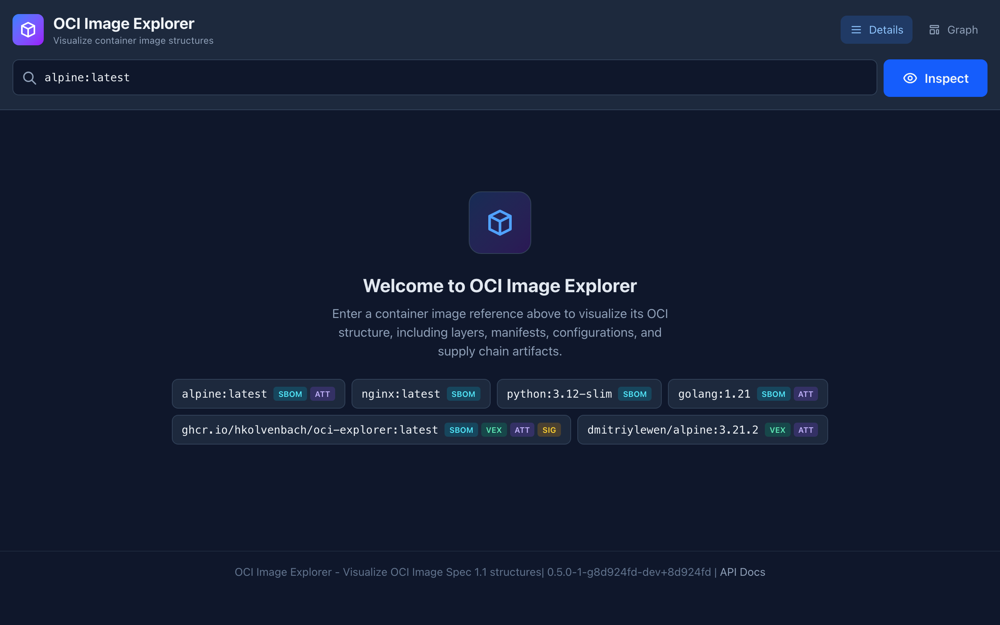
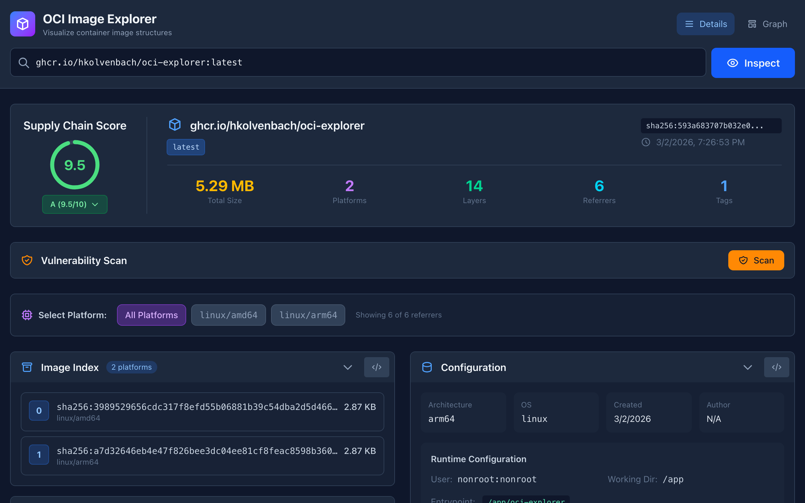
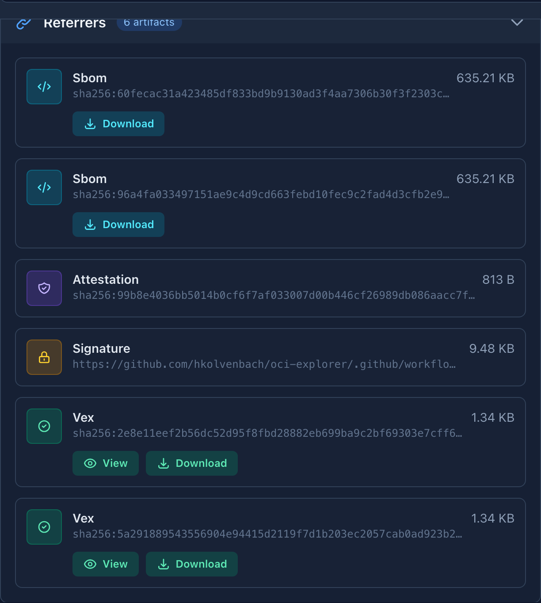
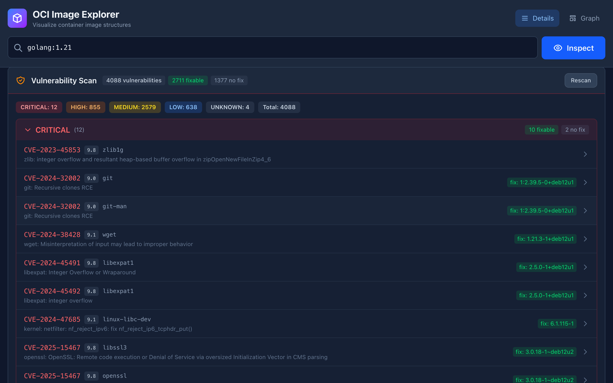
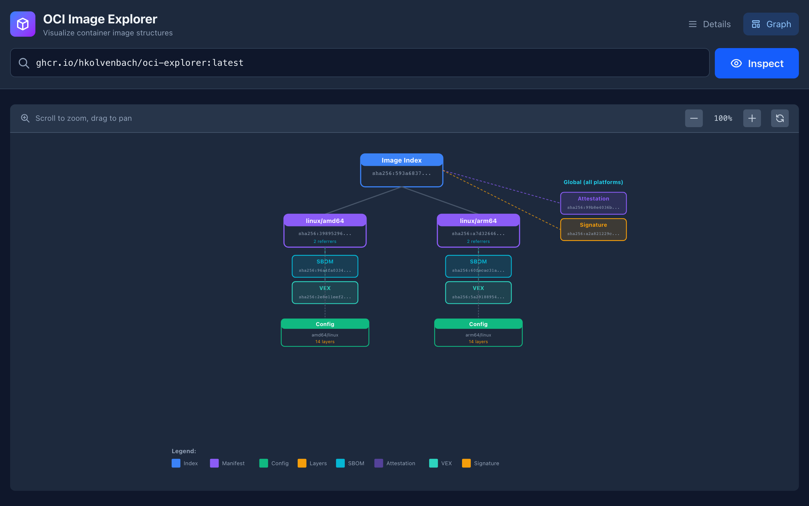
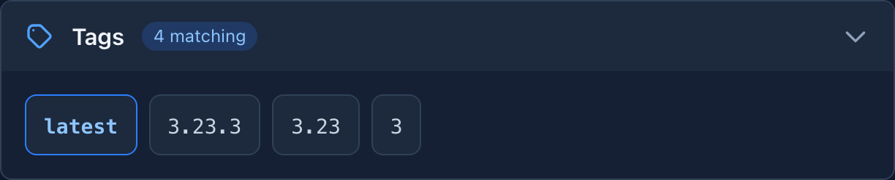
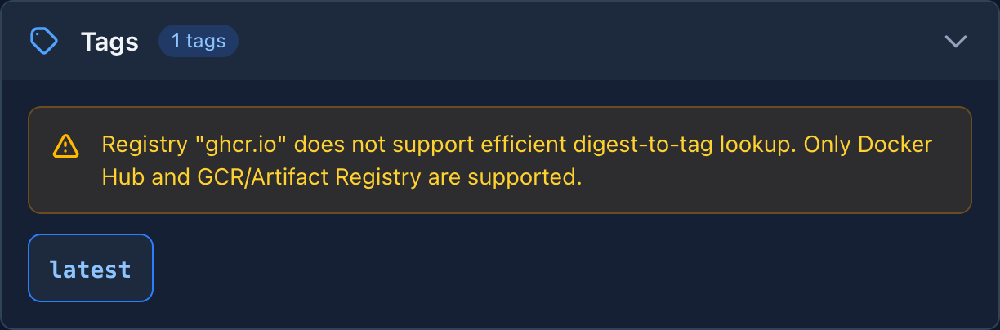

# OCI Image Explorer

A local Go application that visualizes OCI container image structures including layers, manifests, referrers, SBOMs, attestations, and other supply chain artifacts.

    

## Features

- **Multi-platform Image Index** - Visualize fat manifests with all architecture variants (linux/amd64, linux/arm64, etc.). Filter the entire UI by platform to see platform-specific layers, config, and referrers. The image summary shows total size, layer count, and platform count at a glance.
- **Layer Inspection** - View every layer's digest, compressed size, media type, and annotations. Layers are listed in stack order matching the image filesystem.
- **Configuration Details** - Full runtime configuration: architecture, OS, entrypoint, cmd, env vars, exposed ports, working directory, user, and labels. Build history traces each Dockerfile instruction that created a layer, including empty layers from `ENV` and `LABEL` commands.
- **Referrers (OCI 1.1)** - Discover and inspect supply chain artifacts attached via the OCI Referrers API:
  - **Signatures** (Notary, Cosign) with Sigstore certificate identity, OIDC issuer, and signature digest
  - **SBOMs** (CycloneDX, SPDX) with one-click download of the full SBOM document
  - **Attestations** (SLSA Provenance, In-Toto) with inline viewing of attestation payloads
  - **VEX** (OpenVEX) with parsed statements showing vulnerability status, justifications, and affected products
  - **Cosign Tag Discovery** — also finds `.sig` and `.att` cosign-style tags alongside the Referrers API
- **Vulnerability Scanning ([Trivy](https://trivy.dev))** - On-demand CVE scanning with rich detail:
  - CVSS scores from multiple sources (NVD, Red Hat, etc.) displayed per vulnerability and in expanded detail view
  - Severity-grouped collapsible sections (CRITICAL, HIGH, MEDIUM, LOW, UNKNOWN) with per-group counts
  - Two-level filtering: global status filter (header chips) across all groups, plus per-section filter overrides
  - Fixable / no-fix / VEXed status chips with counts at both the scan header and each severity group
  - Expandable CVE details with package metadata, installed and fixed versions, and full description with preserved formatting
  - Reference links to NVD, Red Hat, Debian, Ubuntu, GitHub Advisories, Aqua, and other vulnerability databases
  - Automatic VEX cross-referencing: if the image has OpenVEX referrers, scan results are annotated with VEX status (not affected, fixed, under investigation)
  - Deduplication of identical CVEs across multiple targets (e.g., Go stdlib vulnerabilities found in many binaries are merged into a single entry)
- **Matching Tags** - Discover which tags in a repository point to the same digest. For Docker Hub and GCR/Artifact Registry, shows all aliases (e.g., `alpine:latest` → also `3.23.3`, `3.23`, `3`) with the current tag highlighted. Unsupported registries show an explanatory note.
- **Tag Listing** - Browse all tags for a repository with clickable navigation to inspect any tag.
- **Supply Chain Security Score** - At-a-glance 0–10 score with animated ring and letter grade. Evaluates supply chain artifact presence: signatures, SBOMs, attestations, VEX documents, minimal base image characteristics (few layers, small size, non-root user, no shell entrypoint). Expandable detail panel shows each criterion with pass/fail status.
- **Graph View** - Interactive directed graph with pan, zoom, and fit-to-view controls. Shows the full image structure: image index, platform manifests, configs, layers, and all referrer artifacts (SBOMs, VEX, attestations, signatures) with color-coded nodes and relationship edges.
- **Copyable Digests** - Click any SHA-256 digest in the UI to copy the full value to the clipboard.
- **Mobile Responsive** - Adaptive layout with stacked columns on small screens and side-by-side panels on desktop.
- **Authentication** - Uses Docker credential helpers (`~/.docker/config.json`) for private registries. Supports Docker Hub, GHCR, GCR, ECR, and any registry with a configured credential helper.

## Quick Start

### Prerequisites

- Go 1.25 or later
- Node.js 22+ (for building the Svelte frontend)
- Make (optional, for build automation)
- [Trivy](https://trivy.dev) v0.69+ (optional, for vulnerability scanning)

### Build & Run

```bash
# Clone or download this project
git clone https://github.com/hkolvenbach/oci-explorer.git
cd oci-explorer

# Download dependencies
go mod tidy

# Build and run (Docker — includes Trivy)
make run

# Or manually (requires frontend build first)
cd web && npm ci && npm run build && cd ..
go build -o build/oci-explorer .
./build/oci-explorer
```

The application starts a web server at http://localhost:8080

## Screenshots

### CLI Startup

```
┌─────────────────────────────────────────────────┐
│           🐳 OCI Image Explorer                 │
├─────────────────────────────────────────────────┤
│  URL:      http://localhost:8080                │
│  Platform: darwin/arm64                         │
│  Version:  0.5.0                                │
│  Press Ctrl+C to stop                           │
└─────────────────────────────────────────────────┘
```

### Landing Page



### Details View

Inspecting `ghcr.io/hkolvenbach/oci-explorer:latest` — shows supply chain security score, platforms, layers, configuration, and referrers at a glance:



### Referrers View

Supply chain artifacts discovered via the OCI Referrers API: SBOMs (CycloneDX), cosign signatures with Sigstore identity, attestations (SLSA Provenance), and VEX documents:



### Vulnerability Scan

On-demand Trivy scan of `golang:1.21` — 4,088 deduplicated vulnerabilities across 5 severity levels. Header chips show fixable/no-fix totals; each severity group has its own filter overrides. Expanding a CVE reveals CVSS scores by source (NVD, Red Hat, etc.), package metadata, description, and reference links to vulnerability databases. If the image carries OpenVEX referrers, affected CVEs are automatically annotated with VEX status:



### Graph View

Interactive graph visualization of the full image structure with SBOMs, VEX, attestations, and signatures:



### Command Line Flags

| Flag | Short | Default | Description |
|------|-------|---------|-------------|
| `--port` | | `8080` | HTTP server port |
| `--verbose` | `-v` | `false` | Enable verbose logging |

```bash
# Run on a different port
./build/oci-explorer --port 3000

# Run with verbose logging
./build/oci-explorer -v
```

### Environment Variables

| Variable | Default | Description |
|----------|---------|-------------|
| `PORT` | `8080` | HTTP server port |

## Building for Multiple Platforms

Build binaries for all supported platforms:

```bash
make build-all
```

This creates binaries in the `build/` directory for:
- Linux (amd64, arm64)
- macOS (amd64, arm64)

Create release archives:

```bash
make release
```

## API Endpoints

### GET /api/inspect

Inspect an OCI image and return its full structure.

**Query Parameters:**
- `image` (required) - Image reference (e.g., `nginx:latest`, `ghcr.io/org/repo:tag`)

**Response:**
```json
{
  "success": true,
  "data": {
    "repository": "library/nginx",
    "tag": "latest",
    "digest": "sha256:abc123...",
    "imageIndex": { ... },
    "manifest": { ... },
    "config": { ... },
    "tags": ["latest", "1.25", "1.25.3"],
    "referrers": [ ... ]
  }
}
```

### GET /api/tags

List all tags for a repository.

**Query Parameters:**
- `repository` (required) - Repository reference (e.g., `nginx`, `ghcr.io/org/repo`)

### GET /api/matching-tags

Find all tags in a repository that resolve to the same digest as the given image.

**Query Parameters:**
- `image` (required) - Image reference (e.g., `alpine:latest`, `gcr.io/google-containers/pause:3.2`)

**Registry support:**
| Registry | Strategy |
|---|---|
| Docker Hub | Paginate Hub API, match digests client-side |
| GCR / Artifact Registry | Extended `tags/list` with manifest map (1 request) |
| Other (GHCR, Quay, ECR) | Returns empty list + explanatory note |

**Response:**
```json
{
  "success": true,
  "data": {
    "repository": "index.docker.io/library/alpine",
    "digest": "sha256:25109184c71b...",
    "tags": ["latest", "3.23.3", "3.23", "3"]
  }
}
```

### GET /api/sbom

Download SBOM content from an attestation manifest.

**Query Parameters:**
- `repository` (required) - Full repository name
- `digest` (required) - Digest of the attestation manifest containing the SBOM

**Response:** Raw SBOM content (SPDX or CycloneDX JSON) with `Content-Disposition: attachment`

### GET /api/vex

Fetch and parse a VEX (Vulnerability Exploitability eXchange) document from an attestation.

**Query Parameters:**
- `repository` (required) - Full repository name
- `digest` (required) - Digest of the attestation manifest containing the VEX document

**Response:** Parsed OpenVEX document with statements, status, justifications, and product identifiers.

### GET /api/scan

Scan a container image for vulnerabilities using Trivy (must be installed locally).

**Query Parameters:**
- `image` (required) - Image reference (e.g., `nginx:latest`)

**Response:** Vulnerabilities grouped by severity with CVE details, affected packages, and fix versions.

### GET /api/health

Health check endpoint.

## Usage Examples

### Inspect Public Images

```bash
# Docker Hub
curl "http://localhost:8080/api/inspect?image=nginx:latest"
curl "http://localhost:8080/api/inspect?image=alpine:3.19"

# GitHub Container Registry
curl "http://localhost:8080/api/inspect?image=ghcr.io/sigstore/cosign/cosign:latest"

# Google Container Registry
curl "http://localhost:8080/api/inspect?image=gcr.io/distroless/static:latest"
```

### Find Matching Tags

**Supported registry** (Docker Hub) — shows all tags sharing the same digest, with the queried tag marked "current":



**Unsupported registry** (GHCR) — shows a warning explaining the limitation:



```bash
# Docker Hub — discover that alpine:latest is also tagged 3.23.3, 3.23, 3
curl "http://localhost:8080/api/matching-tags?image=alpine:latest"

# GCR — single-request lookup via extended tags/list
curl "http://localhost:8080/api/matching-tags?image=gcr.io/google-containers/pause:3.2"

# GHCR — returns note (unsupported registry)
curl "http://localhost:8080/api/matching-tags?image=ghcr.io/hkolvenbach/oci-explorer:0.2.2"
```

### Inspect Private Images

The application uses Docker's credential helpers. Log in first:

```bash
# Docker Hub
docker login

# GitHub Container Registry
docker login ghcr.io

# AWS ECR
aws ecr get-login-password | docker login --username AWS --password-stdin <account>.dkr.ecr.<region>.amazonaws.com
```

Then inspect:
```bash
curl "http://localhost:8080/api/inspect?image=ghcr.io/myorg/private-image:v1"
```

## Supply Chain Security

All release artifacts are signed and attested for end-to-end supply chain verification.

| Artifact | Protection |
|----------|-----------|
| Docker image | Cosign keyless signature (Sigstore OIDC) |
| Docker image | SLSA Build Provenance attestation |
| Docker image | Embedded SBOM (BuildKit) |
| Docker image | OpenVEX attestation (govulncheck-based) |
| Release binaries | GitHub Artifact Attestation (SLSA provenance) |
| Runtime base | `gcr.io/distroless/static-debian12` (zero CVEs, no shell) |

### Verify image signature

```bash
cosign verify \
  --certificate-identity-regexp="https://github.com/hkolvenbach/oci-explorer" \
  --certificate-oidc-issuer="https://token.actions.githubusercontent.com" \
  ghcr.io/hkolvenbach/oci-explorer:latest
```

### Verify SLSA provenance

```bash
cosign verify-attestation \
  --type slsaprovenance1 \
  --certificate-identity-regexp="https://github.com/hkolvenbach/oci-explorer" \
  --certificate-oidc-issuer="https://token.actions.githubusercontent.com" \
  ghcr.io/hkolvenbach/oci-explorer:latest
```

### Verify OpenVEX attestation

```bash
cosign verify-attestation \
  --type openvex \
  --certificate-identity-regexp="https://github.com/hkolvenbach/oci-explorer" \
  --certificate-oidc-issuer="https://token.actions.githubusercontent.com" \
  ghcr.io/hkolvenbach/oci-explorer:latest
```

### Verify binary provenance (GitHub Artifact Attestation)

```bash
gh release download v0.2.2 --repo hkolvenbach/oci-explorer \
  --pattern 'oci-explorer-*-linux-amd64.tar.gz'
gh attestation verify oci-explorer-0.2.2-linux-amd64.tar.gz \
  --repo hkolvenbach/oci-explorer
```

### Inspect embedded SBOM

```bash
docker buildx imagetools inspect ghcr.io/hkolvenbach/oci-explorer:latest \
  --format '{{ json .SBOM }}'
```

### Explore with OCI Image Explorer

You can also use OCI Image Explorer itself to visually inspect all of these supply chain artifacts — signatures, SBOMs, attestations, and provenance — by pointing it at its own image:

```
http://localhost:8080/?image=ghcr.io/hkolvenbach/oci-explorer:latest
```

## Project Structure

```
oci-explorer/
├── adrs/                # Architecture decision records
├── docs/
│   ├── api.md           # API reference (served at /docs/)
│   ├── openapi.yaml     # OpenAPI specification (served at /api/openapi.yaml)
│   └── screenshots/     # Browser screenshots for README
├── docshandler/         # Documentation HTTP handlers (extracted from main.go)
│   ├── docshandler.go   # ServeDocs, ServeOpenAPISpec, markdownToHTML
│   └── docshandler_test.go
├── registry/
│   ├── client.go        # OCI registry client using go-containerregistry
│   ├── client_test.go   # Registry client tests
│   └── testdata/        # Test fixtures (Alpine, Kairos, VEX sample data)
├── scanner/
│   ├── scanner.go       # Trivy vulnerability scanner (subprocess-based)
│   └── scanner_test.go  # Scanner unit tests
├── tools/
│   ├── download-alpine/ # Alpine test data downloader
│   └── sbom-extractor/  # Reference SBOM extraction tool
├── web/                 # Svelte 5 + TypeScript frontend (Vite)
│   ├── src/
│   │   ├── components/  # Svelte components
│   │   ├── lib/         # API client, types, state, utilities
│   │   ├── App.svelte   # Root component
│   │   └── main.ts      # Entry point
│   └── package.json
├── Dockerfile           # Container build
├── fly.toml             # Fly.io deployment config
├── main.go              # HTTP server and handlers
├── Makefile             # Build automation
├── go.mod               # Go module definition
├── go.sum               # Dependency checksums
├── LICENSE              # Apache 2.0
├── README.md            # This file
└── REFERENCES.md        # OCI and SBOM specification references
```

## Dependencies

### Backend
- [google/go-containerregistry](https://github.com/google/go-containerregistry) - OCI registry client
- [gorilla/mux](https://github.com/gorilla/mux) - HTTP router
- [Trivy](https://github.com/aquasecurity/trivy) - Vulnerability scanner (Apache 2.0 license, bundled in Docker image)

### Frontend
- [Svelte 5](https://svelte.dev) - Reactive UI framework
- [Tailwind CSS 4](https://tailwindcss.com) - Utility-first CSS
- [Vite 6](https://vite.dev) - Build tool

## OCI Specification Support

This tool supports OCI Image Spec 1.1 features including:

- **Image Index** (fat manifests) for multi-platform images
- **Image Manifest** with config and layer descriptors
- **Image Configuration** with runtime settings and build history
- **Referrers API** for attached artifacts (signatures, SBOMs, attestations)
- **Annotations** on all descriptor types

## License

Apache License 2.0
