# Alpine:latest Test Data

This directory contains downloaded manifests and attestations for `alpine:latest` from Docker Hub.

## Image Structure Diagram

```mermaid
graph TD
    A[Image Index<br/>image_index.json<br/>sha256:865b95f46d98...] --> B1[Platform: linux/amd64<br/>manifest_1882fa4569e0.json<br/>sha256:1882fa4569e0...]
    A --> B2[Platform: linux/arm/v6<br/>manifest_cd194307b351.json<br/>sha256:cd194307b351...]
    A --> B3[Platform: linux/arm/v7<br/>manifest_d320aee52817.json<br/>sha256:d320aee52817...]
    A --> B4[Platform: linux/arm64/v8<br/>manifest_410dabcd6f1d.json<br/>sha256:410dabcd6f1d...]
    A --> B5[Platform: linux/386<br/>manifest_16ff8a639f58.json<br/>sha256:16ff8a639f58...]
    A --> B6[Platform: linux/ppc64le<br/>manifest_a78fa7e4e732.json<br/>sha256:a78fa7e4e732...]
    A --> B7[Platform: linux/riscv64<br/>manifest_6b283ad1125d.json<br/>sha256:6b283ad1125d...]
    A --> B8[Platform: linux/s390x<br/>manifest_e1fe68c8d560.json<br/>sha256:e1fe68c8d560...]
    
    A --> A1[Attestation: amd64<br/>manifest_f9fd905ebc9c.json<br/>sha256:f9fd905ebc9c...]
    A --> A2[Attestation: arm/v6<br/>manifest_12dea40f86f3.json<br/>sha256:12dea40f86f3...]
    A --> A3[Attestation: arm/v7<br/>manifest_823ade00a6dc.json<br/>sha256:823ade00a6dc...]
    A --> A4[Attestation: arm64/v8<br/>manifest_b8b03df6fb6f.json<br/>sha256:b8b03df6fb6f...]
    A --> A5[Attestation: 386<br/>manifest_10557b46ac59.json<br/>sha256:10557b46ac59...]
    A --> A6[Attestation: ppc64le<br/>manifest_bd761fcd6f08.json<br/>sha256:bd761fcd6f08...]
    A --> A7[Attestation: riscv64<br/>manifest_89dcdffaf28d.json<br/>sha256:89dcdffaf28d...]
    A --> A8[Attestation: s390x<br/>manifest_00dba905f263.json<br/>sha256:00dba905f263...]
    
    B1 --> C1[config.json<br/>sha256:e7b39c54cdeca0...]
    B2 --> C2[config.json<br/>sha256:...]
    B3 --> C3[config.json<br/>sha256:...]
    B4 --> C4[config.json<br/>sha256:...]
    B5 --> C5[config.json<br/>sha256:...]
    B6 --> C6[config.json<br/>sha256:...]
    B7 --> C7[config.json<br/>sha256:...]
    B8 --> C8[config.json<br/>sha256:...]
    
    A1 -.references.-> B1
    A2 -.references.-> B2
    A3 -.references.-> B3
    A4 -.references.-> B4
    A5 -.references.-> B5
    A6 -.references.-> B6
    A7 -.references.-> B7
    A8 -.references.-> B8
    
    A1 --> L1A[SBOM Layer<br/>layer_0_5c1f58ba4e0d.json<br/>SPDX Document]
    A1 --> L1B[Provenance Layer<br/>layer_1_644afed44dca.json<br/>SLSA v0.2]
    
    A2 --> L2A[Provenance Layer<br/>layer_0_c29e4c1977b4.json<br/>SLSA v0.2]
    
    A3 --> L3A[SBOM Layer<br/>layer_0_8c23028141b7.json<br/>SPDX Document]
    A3 --> L3B[Provenance Layer<br/>layer_1_a576b4c646f1.json<br/>SLSA v0.2]
    
    A4 --> L4A[SBOM Layer<br/>layer_0_0d38fd5b3194.json<br/>SPDX Document]
    A4 --> L4B[Provenance Layer<br/>layer_1_4fbdf2544c91.json<br/>SLSA v0.2]
    
    A5 --> L5A[SBOM Layer<br/>layer_0_93d91cf859d4.json<br/>SPDX Document]
    A5 --> L5B[Provenance Layer<br/>layer_1_ac10394e9a1e.json<br/>SLSA v0.2]
    
    A6 --> L6A[SBOM Layer<br/>layer_0_6825a608256a.json<br/>SPDX Document]
    A6 --> L6B[Provenance Layer<br/>layer_1_b4b137ac9ee8.json<br/>SLSA v0.2]
    
    A7 --> L7A[SBOM Layer<br/>layer_0_3ba01e8490eb.json<br/>SPDX Document]
    A7 --> L7B[Provenance Layer<br/>layer_1_dbbd7c856a8c.json<br/>SLSA v0.2]
    
    A8 --> L8A[SBOM Layer<br/>layer_0_0ab41aa147da.json<br/>SPDX Document]
    A8 --> L8B[Provenance Layer<br/>layer_1_85ca2f88d269.json<br/>SLSA v0.2]
    
    style A fill:#3b82f6,stroke:#1e40af,color:#fff
    style B1 fill:#8b5cf6,stroke:#6d28d9,color:#fff
    style B2 fill:#8b5cf6,stroke:#6d28d9,color:#fff
    style B3 fill:#8b5cf6,stroke:#6d28d9,color:#fff
    style B4 fill:#8b5cf6,stroke:#6d28d9,color:#fff
    style B5 fill:#8b5cf6,stroke:#6d28d9,color:#fff
    style B6 fill:#8b5cf6,stroke:#6d28d9,color:#fff
    style B7 fill:#8b5cf6,stroke:#6d28d9,color:#fff
    style B8 fill:#8b5cf6,stroke:#6d28d9,color:#fff
    style A1 fill:#06b6d4,stroke:#0891b2,color:#fff
    style A2 fill:#06b6d4,stroke:#0891b2,color:#fff
    style A3 fill:#06b6d4,stroke:#0891b2,color:#fff
    style A4 fill:#06b6d4,stroke:#0891b2,color:#fff
    style A5 fill:#06b6d4,stroke:#0891b2,color:#fff
    style A6 fill:#06b6d4,stroke:#0891b2,color:#fff
    style A7 fill:#06b6d4,stroke:#0891b2,color:#fff
    style A8 fill:#06b6d4,stroke:#0891b2,color:#fff
```



## File Links and Fetch Order

### Step 1: Fetch Image Index
**File:** `image_index.json`  
**Digest:** `sha256:865b95f46d98cf867a156fe4a135ad3fe50d2056aa3f25ed31662dff6da4eb62`  
**Contains:** References to 16 manifests (8 platforms + 8 attestations)

### Step 2: Fetch Platform Manifests (Parallel)

#### Platform: linux/amd64
- **Manifest:** `platforms/linux_amd64/manifest_1882fa4569e0.json`
  - **Digest:** `sha256:1882fa4569e0c591ea092d3766c4893e19b8901a8e649de7067188aba3cc0679`
  - **Config Reference:** `sha256:e7b39c54cdeca0d2aae83114bb605753a5f5bc511fe8be7590e38f6d9f915dad`
  - **Config File:** `platforms/linux_amd64/config.json`
  - **Linked Attestation:** `attestations/1882fa4569e0/manifest_f9fd905ebc9c.json` (via `vnd.docker.reference.digest`)

#### Platform: linux/arm/v6
- **Manifest:** `platforms/linux_arm_v6/manifest_cd194307b351.json`
  - **Digest:** `sha256:cd194307b3514d0b3eb229a1f6b0c92be4dd0e714b109a488269837170317944`
  - **Config File:** `platforms/linux_arm_v6/config.json`
  - **Linked Attestation:** `attestations/cd194307b351/manifest_12dea40f86f3.json`

#### Platform: linux/arm/v7
- **Manifest:** `platforms/linux_arm_v7/manifest_d320aee52817.json`
  - **Digest:** `sha256:d320aee528174169f76afc8ebd02feb0a42824bc2264d0da1761edff6f06bc5f`
  - **Config File:** `platforms/linux_arm_v7/config.json`
  - **Linked Attestation:** `attestations/d320aee52817/manifest_823ade00a6dc.json`

#### Platform: linux/arm64/v8
- **Manifest:** `platforms/linux_arm64_v8/manifest_410dabcd6f1d.json`
  - **Digest:** `sha256:410dabcd6f1d53f1f4e5c1ce9553efa298ca6bcdd086dfc976b8f659d58b46d2`
  - **Config File:** `platforms/linux_arm64_v8/config.json`
  - **Linked Attestation:** `attestations/410dabcd6f1d/manifest_b8b03df6fb6f.json`

#### Platform: linux/386
- **Manifest:** `platforms/linux_386/manifest_16ff8a639f58.json`
  - **Digest:** `sha256:16ff8a639f58b38d94b054e94c106dbbd8a60d45f8b1989f98516a3e8e0792ad`
  - **Config File:** `platforms/linux_386/config.json`
  - **Linked Attestation:** `attestations/16ff8a639f58/manifest_10557b46ac59.json`

#### Platform: linux/ppc64le
- **Manifest:** `platforms/linux_ppc64le/manifest_a78fa7e4e732.json`
  - **Digest:** `sha256:a78fa7e4e73252c55e6ebd28dfb1e78d82a0f70d392e2cddcc7f545bf7d7ec16`
  - **Config File:** `platforms/linux_ppc64le/config.json`
  - **Linked Attestation:** `attestations/a78fa7e4e732/manifest_bd761fcd6f08.json`

#### Platform: linux/riscv64
- **Manifest:** `platforms/linux_riscv64/manifest_6b283ad1125d.json`
  - **Digest:** `sha256:6b283ad1125de2c183bcff24bc68f96eb034d09dd3ee56b8c7ba7dc832e5c1e7`
  - **Config File:** `platforms/linux_riscv64/config.json`
  - **Linked Attestation:** `attestations/6b283ad1125d/manifest_89dcdffaf28d.json`

#### Platform: linux/s390x
- **Manifest:** `platforms/linux_s390x/manifest_e1fe68c8d560.json`
  - **Digest:** `sha256:e1fe68c8d560a9853093a5e8ee615f3808116d97b634b774ccbace73d1de8956`
  - **Config File:** `platforms/linux_s390x/config.json`
  - **Linked Attestation:** `attestations/e1fe68c8d560/manifest_00dba905f263.json`

### Step 3: Fetch Attestation Manifests (Parallel)

#### Attestation for linux/amd64
- **Manifest:** `attestations/1882fa4569e0/manifest_f9fd905ebc9c.json`
  - **Digest:** `sha256:f9fd905ebc9c0e5e6dac67fb89753e85b7b831273995bdca248ba4cb74ba2dc9`
  - **References Platform:** `sha256:1882fa4569e0c591ea092d3766c4893e19b8901a8e649de7067188aba3cc0679` (via `vnd.docker.reference.digest`)
  - **SBOM Layer:** `attestations/1882fa4569e0/layer_0_5c1f58ba4e0d.json` (SPDX Document)
  - **Provenance Layer:** `attestations/1882fa4569e0/layer_1_644afed44dca.json` (SLSA v0.2)

#### Attestation for linux/arm/v6
- **Manifest:** `attestations/cd194307b351/manifest_12dea40f86f3.json`
  - **Digest:** `sha256:12dea40f86f302a827397587f50224bd18770941bca6ac880390cb336303b778`
  - **References Platform:** `sha256:cd194307b3514d0b3eb229a1f6b0c92be4dd0e714b109a488269837170317944`
  - **Provenance Layer:** `attestations/cd194307b351/layer_0_c29e4c1977b4.json` (SLSA v0.2)
  - **Note:** This attestation only has provenance, no SBOM layer

#### Attestation for linux/arm/v7
- **Manifest:** `attestations/d320aee52817/manifest_823ade00a6dc.json`
  - **Digest:** `sha256:823ade00a6dc01039ba8c7bc8d5cc8075ee45ad513b3295a90083a315a05ce3c`
  - **References Platform:** `sha256:d320aee528174169f76afc8ebd02feb0a42824bc2264d0da1761edff6f06bc5f`
  - **SBOM Layer:** `attestations/d320aee52817/layer_0_8c23028141b7.json` (SPDX Document)
  - **Provenance Layer:** `attestations/d320aee52817/layer_1_a576b4c646f1.json` (SLSA v0.2)

#### Attestation for linux/arm64/v8
- **Manifest:** `attestations/410dabcd6f1d/manifest_b8b03df6fb6f.json`
  - **Digest:** `sha256:b8b03df6fb6f8b5b7d23c7b607747e2071243bac0db5112e956591a43da59cff`
  - **References Platform:** `sha256:410dabcd6f1d53f1f4e5c1ce9553efa298ca6bcdd086dfc976b8f659d58b46d2`
  - **SBOM Layer:** `attestations/410dabcd6f1d/layer_0_0d38fd5b3194.json` (SPDX Document)
  - **Provenance Layer:** `attestations/410dabcd6f1d/layer_1_4fbdf2544c91.json` (SLSA v0.2)

#### Attestation for linux/386
- **Manifest:** `attestations/16ff8a639f58/manifest_10557b46ac59.json`
  - **Digest:** `sha256:10557b46ac595cfe54930c99d40caeda9a15f1d3e493090b06beba5b8b70bd1b`
  - **References Platform:** `sha256:16ff8a639f58b38d94b054e94c106dbbd8a60d45f8b1989f98516a3e8e0792ad`
  - **SBOM Layer:** `attestations/16ff8a639f58/layer_0_93d91cf859d4.json` (SPDX Document)
  - **Provenance Layer:** `attestations/16ff8a639f58/layer_1_ac10394e9a1e.json` (SLSA v0.2)

#### Attestation for linux/ppc64le
- **Manifest:** `attestations/a78fa7e4e732/manifest_bd761fcd6f08.json`
  - **Digest:** `sha256:bd761fcd6f08b37be19e84f4e6c63f3665c0357ba2174a65f19f8078bb2cc0e9`
  - **References Platform:** `sha256:a78fa7e4e73252c55e6ebd28dfb1e78d82a0f70d392e2cddcc7f545bf7d7ec16`
  - **SBOM Layer:** `attestations/a78fa7e4e732/layer_0_6825a608256a.json` (SPDX Document)
  - **Provenance Layer:** `attestations/a78fa7e4e732/layer_1_b4b137ac9ee8.json` (SLSA v0.2)

#### Attestation for linux/riscv64
- **Manifest:** `attestations/6b283ad1125d/manifest_89dcdffaf28d.json`
  - **Digest:** `sha256:89dcdffaf28d22684df7b256a089f54706b7890bde407889f5ba90e620e3cae0`
  - **References Platform:** `sha256:6b283ad1125de2c183bcff24bc68f96eb034d09dd3ee56b8c7ba7dc832e5c1e7`
  - **SBOM Layer:** `attestations/6b283ad1125d/layer_0_3ba01e8490eb.json` (SPDX Document)
  - **Provenance Layer:** `attestations/6b283ad1125d/layer_1_dbbd7c856a8c.json` (SLSA v0.2)

#### Attestation for linux/s390x
- **Manifest:** `attestations/e1fe68c8d560/manifest_00dba905f263.json`
  - **Digest:** `sha256:00dba905f263dba1db0300756d4a74af745f2e3a94f30c802450314af9af2202`
  - **References Platform:** `sha256:e1fe68c8d560a9853093a5e8ee615f3808116d97b634b774ccbace73d1de8956`
  - **SBOM Layer:** `attestations/e1fe68c8d560/layer_0_0ab41aa147da.json` (SPDX Document)
  - **Provenance Layer:** `attestations/e1fe68c8d560/layer_1_85ca2f88d269.json` (SLSA v0.2)

## Fetch Order and Dependencies

### Sequential Fetch Order (as implemented in code)

1. **Image Index** → Fetched first to discover all manifests
2. **Platform Manifests** → Fetched in parallel (8 concurrent requests)
3. **Platform Configs** → Fetched in parallel after platform manifests (8 concurrent requests)
4. **Attestation Manifests** → Fetched in parallel (8 concurrent requests)
5. **Attestation Layers** → Fetched in parallel after attestation manifests (up to 16 concurrent requests, 2 per attestation)

### Link Relationships

```
image_index.json
  ├─> platforms/linux_amd64/manifest_1882fa4569e0.json
  │     ├─> platforms/linux_amd64/config.json (via config.digest)
  │     └─< attestations/1882fa4569e0/manifest_f9fd905ebc9c.json
  │           ├─> attestations/1882fa4569e0/layer_0_5c1f58ba4e0d.json (SBOM)
  │           └─> attestations/1882fa4569e0/layer_1_644afed44dca.json (Provenance)
  │
  ├─> platforms/linux_arm_v6/manifest_cd194307b351.json
  │     ├─> platforms/linux_arm_v6/config.json
  │     └─< attestations/cd194307b351/manifest_12dea40f86f3.json
  │           └─> attestations/cd194307b351/layer_0_c29e4c1977b4.json (Provenance only)
  │
  └─> ... (6 more platforms with similar structure)
```

**Legend:**
- `├─>` = Direct reference (digest in manifest)
- `└─<` = Reverse reference (via `vnd.docker.reference.digest` annotation)

## Structure

- `image_index.json` - The OCI image index manifest containing all platform manifests and attestations
- `platforms/` - Platform-specific image manifests and configs
  - `linux_amd64/` - AMD64 platform manifest + config.json
  - `linux_arm_v6/` - ARM v6 platform manifest + config.json
  - `linux_arm_v7/` - ARM v7 platform manifest + config.json
  - `linux_arm64_v8/` - ARM64 v8 platform manifest + config.json
  - `linux_386/` - 386 platform manifest + config.json
  - `linux_ppc64le/` - PPC64LE platform manifest + config.json
  - `linux_riscv64/` - RISC-V 64 platform manifest + config.json
  - `linux_s390x/` - S390x platform manifest + config.json
- `attestations/` - Attestation manifests organized by platform digest
  - Each subdirectory is named after the first 12 characters of the platform manifest digest
  - Contains attestation manifests and their SBOM/provenance layers

## Usage

These test fixtures can be used to test:
- Multi-platform image index parsing
- Platform manifest and config extraction
- Attestation manifest extraction
- Platform-specific referrer association
- SBOM and provenance layer extraction
- Config file parsing and history extraction

## Download Date

Downloaded on: 2025-01-14

## Image Details

- **Image**: alpine:latest
- **Index Digest**: sha256:865b95f46d98cf867a156fe4a135ad3fe50d2056aa3f25ed31662dff6da4eb62
- **Total Manifests**: 16 (8 platform manifests + 8 attestation manifests)
- **Platforms**: amd64, arm/v6, arm/v7, arm64/v8, 386, ppc64le, riscv64, s390x

## Attestation Structure

Each platform has an associated attestation manifest with:
- `vnd.docker.reference.type: attestation-manifest`
- `vnd.docker.reference.digest`: Points to the platform manifest digest
- Layers containing:
  - SPDX SBOM documents (`in-toto.io/predicate-type: https://spdx.dev/Document`)
  - SLSA provenance (`in-toto.io/predicate-type: https://slsa.dev/provenance/v0.2`)

## Key Observations

1. **One-to-One Mapping**: Each platform has exactly one attestation manifest
2. **Attestation Linking**: Attestations are linked via `vnd.docker.reference.digest` annotation pointing to platform digest
3. **Layer Variability**: Most attestations have both SBOM and Provenance layers, but linux/arm/v6 only has Provenance
4. **Parallel Fetching**: All platform manifests, configs, and attestations can be fetched in parallel for optimal performance
